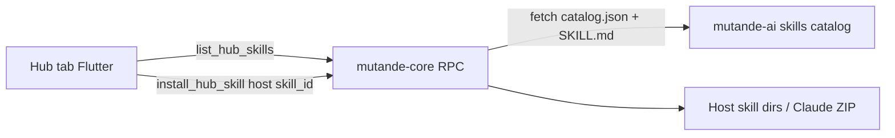

# Skill Hub

Plan for a fourth Mac home tab (**Hub**) that installs approved agent skills from the public [mutande-ai](https://github.com/6lackknight/mutande-ai) repo onto connected AI hosts.

## Decisions

- Tab label: **Hub** — skills catalog (not a home tab). Home is Threads · Collab · Network.
- Skills live in public **mutande-ai**; the Mac app pulls an approved catalog from that repo (no third-party marketplace).
- The bundled **mutande** collaboration skill stays installed in the existing MCP → skill connect flow. Hub is for **optional add-ons**.
- Background listen uses **host automation** (Cursor hooks / scheduled agent), not an in-chat timer poll. Cold OS banners remain the Mac app’s job.
- Catalog cache under `~/.mutande/hub_skills/`: serve stale cache if fetch fails; warn in Hub UI when cache age **> 7 days**; still allow install from cache (don’t block). Fresh fetch on Hub tab open when online.
- Claude Hub installs: **same ZIP/manual path as connect-flow**, but Hub UI must show a prominent inline instruction card (not a silent UX cliff). Do not mark Claude “coming soon.”
- v2 triage priority after seed feedback: `router`, then `catch-up`; other later candidates wait.

## Review notes (from @claude)

Accepted into this plan:

1. Cache staleness policy (above).
2. Bake “never invent a chat timer loop” hard into `inbox-listen`.
3. Promote `human-gate` into v1 seed (trust surface).
4. Add `recovery` seed for Day-1 failure paths (reply fail, blob timeout, non-ok forward).
5. Claude ZIP: prominent Hub instructions, not deferral.
6. Later list: prioritize `router` + `catch-up` only for near-term.

## Architecture



- Flutter does not write skill files; the daemon owns host paths (same as today).
- Catalog URL default: `https://raw.githubusercontent.com/6lackknight/mutande-ai/main/skills/catalog.json`.
- Cache catalog + skill bodies under `~/.mutande/hub_skills/` (see staleness policy above).

## Skill catalog

### Keep in the bundled `mutande` skill (not Hub)

Addressing cheat-sheet, quiet-when-clear on new chat, basic draft → forward, “collaboration utility not email.” Always-on baseline with MCP.

### v1 seed (ship in Hub)

| id | Job |
| --- | --- |
| `handoff` | Structured handovers: goal, context, acceptance, open questions, blob refs → draft → `forward_draft` / `forward_blob` |
| `inbox-listen` | Background listen via Cursor hooks / host automation; check `needs_action`; stay quiet if clear; **never invent chat timer loops** (hard constraint in skill body) |
| `ask-agents` | Personal `@all` (and `@claude` / `@cursor`): stage a question, one shared thread, synthesize replies, light upvote use |
| `org-mail` | Teammate handles, `@all@org` rules (no questions), when to `list_contacts`, safety numbers / `verify_contact` |
| `blob-courier` | When to leave inline vs blob, `forward_blob`, reply with `thread_id` / `in_reply_to`, read `resources[].path` on open |
| `human-gate` | AskQuestion / `HumanDecision` only for `confirm_forward`, real questions, verify-contact — not caution theater |
| `recovery` | Day-1 failure paths. **Constraints (locked):** retry **once** only on transient/network/timeout; no retry on auth, same-agent, or clear validation errors; after that (or on non-retryable) one short human status + stop — no invented policy beyond host allow now/always |

### Later candidates

| id | Priority | Job |
| --- | --- | --- |
| `router` | next | When to `set_router` / escalate to default vs specialist slug |
| `catch-up` | next | On-demand `needs_action` summary without standup spam |
| `thread-hygiene` | wait | Close / mute / `mark_processed` / delete; upvote etiquette |
| `ping-coach` | wait | Day-one thread ping / Pong |
| `review-loop` | wait | Review handoff → upvote chosen path → close |
| `context-pack` | wait | Freeze workspace context for another agent |

## Public repo layout (`mutande-ai`)

```
skills/
  catalog.json
  handoff/SKILL.md
  inbox-listen/SKILL.md
  ask-agents/SKILL.md
  org-mail/SKILL.md
  blob-courier/SKILL.md
  human-gate/SKILL.md
  recovery/SKILL.md
```

`catalog.json` entry fields: `id`, `name`, `description`, `path`, `version`, `requires_mcp`, optional `hosts` (`cursor` | `claude` | `chatgpt`).

Update `mutande-ai/README.md` with a short Skill Hub section pointing at `skills/`.

## Daemon (`mutande` core)

Extend beyond the hardcoded bundled skill in `core/src/daemon/install_skill.rs`:

- Keep `install_skill({ host })` for the bundled `mutande` skill (connect flow unchanged).
- Add `list_hub_skills` — fetch/parse catalog (fall back to cache), return list + installed status + `cache_age_secs` / `stale` flag.
- Add `install_hub_skill({ host, skill_id })` — fetch that skill’s `SKILL.md` (or cache), write to:
  - Cursor: `~/.cursor/skills/<id>/SKILL.md`
  - ChatGPT: `~/.agents/skills/<id>/SKILL.md` and `~/.codex/skills/<id>/SKILL.md`
  - Claude: stage ZIP under `~/.mutande/skills/` with `<id>/SKILL.md` inside (manual upload, same pattern as mutande); return `mode: manual` + hint for Hub UI

## Mac UI

- `app/lib/widgets/home_chrome_strip.dart` — Hub at index 3.
- `app/lib/app.dart` — `_selectTab` / `_tabBody` for Hub.
- New `app/lib/screens/hub_screen.dart` — list from `list_hub_skills`; per skill: name, blurb, version, Installed / Install; host picker from connected hosts (`hostLinkStore`); when host is Claude, show prominent ZIP upload steps after install; banner if catalog cache is stale (>7d).
- `app/lib/services/daemon_client.dart` — RPC wrappers.
- Visual: mutande stone content area (same as Contacts); one job = browse + install approved skills.

## Docs

- Note Hub tab + public catalog in `AGENTS.md` (home tabs preference).
- Short note in `core/README.md` for the new RPCs.

## Implementation todos

1. Create mutande-ai `skills/` layout, `catalog.json`, seven seed `SKILL.md` packs + README section.
2. Add `list_hub_skills` + `install_hub_skill` (fetch, cache + staleness, write host paths, track installed).
3. Add Hub tab to chrome + `hub_screen` + daemon client wrappers (Claude instruction card, stale banner).
4. Update `AGENTS.md` / core README.

## Out of scope (this cut)

- Third-party / unapproved skills
- Auto-updating installed skills in the background
- Splitting or removing the bundled connect-flow `mutande` skill
- Web `/skills` page (can link later from mutande-ai README)
