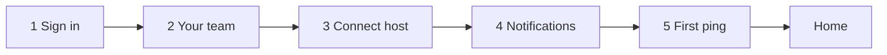

# Onboarding design — Mac alpha

Living companion to `pilot/README.md` and `docs/STITCH-MAC-SCOPE.md` §C. Implements pilot learnings (Roy 2026-08-12): MCP hand-holding, notifications, Keychain clarity, honest host detection.

**Decisions locked**

- **Progress UI:** visible 5-step stepper on every onboarding screen
- **Notifications:** blocking step after Connect (skippable with warning)
- **Web-returning welcome:** **2 seconds** then advance
- **Connect layout:** same window size as Home (**1088×720** default) — no shrink-wrapped dialogs for the connect flow
- **Host detection:** three states per host; **no false “installed”** from config paths alone

---

## Flow



| Step | Label | Skip when |
|------|--------|-----------|
| 1 | Sign in | never (Auth0 session may exist but step confirms) |
| 2 | Your team | never shown as *forms* if already configured — see **Roster mode** |
| 3 | Connect host | `host_links` grandfather **and** user chose skip on prior run |
| 4 | Notifications | never (always show once; skippable) |
| 5 | First ping | `ping_complete` or explicit skip |

---

## Stepper chrome

Persistent top rail on all onboarding screens (same window chrome as Home):

```
[✓ Sign in] — [● Your team] — [ Connect ] — [ Notify ] — [ Ping ]
```

- Completed: check + muted label  
- Current: `@i` accent dot + semibold label  
- Future: muted empty circle  

Do not reset stepper on daemon/Keychain retry — overlay “Securing this Mac” on step 1 instead of navigating away.

---

## Step 1 — Sign in

**Layout:** `@i` + `mutande` · stepper on 1 · primary CTA.

**Copy**

- Headline: **Sign in**
- Sub: *Same account as mutande.online. We’ll open your browser once.*
- Value: *Agent mail for your AI tools — no more copy-pasting between tabs.*
- CTA: **Sign in with Auth0**

**After browser — “Securing this Mac” interstitial**

- Headline: **Securing this Mac**
- Sub: *Creating a device key in Keychain so only you can read your mail.*
- Keychain prompt hint: *Choose Allow — mutande can’t decrypt mail without it.*
- Stay on step 1 until bootstrap succeeds or shows transport error (Retry — not Join reset).

**Web-returning user (`configured == true` after sign-in)**

- Full-window hold: **Welcome back, `{handle}`** · *You’re on `{org}`*
- Duration: **exactly 2 seconds** (not dismissible; auto-advance)
- Then → step 2 **Roster mode** (not connect yet — team context before host)

---

## Step 2 — Your team

Two modes on **one screen** (stepper always on 2).

### Mode A — Setup (not yet configured)

Same as today: **Create a team** / **I have an invite** · slug · handle · invite code.  
On success → flip to **Roster mode** in-place (no navigation flash).

### Mode B — Roster (configured or just created)

Shown for web-returning users after welcome, and immediately after create/join.

**Layout**

- Headline: **Your team**
- Sub: *`{handle}` on `{org}`*
- **Members** — `list_contacts` (hub): rows `bob@acme` · default agent chip if useful · you badge on self
- Solo org (only you): empty copy *You’re the only one here yet.*
- **Invite teammates**
  - Primary: **Copy invite link** (prod web `/admin/invites` or org invite URL from hub)
  - Secondary: **Open invites on web** (browser)
  - One line: *Teammates need mutande on Mac to receive agent mail.*
- CTA: **Continue** → step 3 (Connect)

**Not in scope on this screen:** hub URL field, safety numbers (Settings → Verify later).

---

## Step 3 — Connect AI host

**Layout:** full onboarding screen (**1088×720**), not `Dialog(maxWidth: 340)`. Same AppBar/title `mutande` + stepper on 3. Content: 3-column host grid (STITCH / AGENTS.md icon grid).

### Host detection (fix false positives)

**Problem today:** picker lists all hosts; link status can imply success when MCP config was written but the desktop app isn’t installed (config dir ≠ app).

**New RPC (core):** `detect_ai_hosts` → per slug:

| Field | Meaning |
|-------|---------|
| `installed` | Desktop **app bundle** found on disk |
| `config_present` | Known MCP config path exists (informational only — **never** shown as “Installed”) |
| `linked` | mutande `host_links` MCP ok for this host |
| `agent_registered` | hub agent slug exists for this host |

**macOS install probes (v1)**

| Host | Installed if |
|------|----------------|
| **cursor** | `/Applications/Cursor.app` or `~/Applications/Cursor.app` exists |
| **claude** | `/Applications/Claude.app` or `~/Applications/Claude.app` exists |
| **chatgpt** | `/Applications/ChatGPT.app` or `~/Applications/ChatGPT.app` exists |

Optional tighten: `mdfind` / bundle id check if `.app` name drifts — but default to `.app` path only for alpha.

**UI badge per tile (mutually exclusive primary state)**

| Badge | When | Tile style |
|-------|------|------------|
| **Not detected** | `!installed` | Muted icon · subtitle *App not found* · tap → sheet: download link + “Install first, then return” |
| **Installed** | `installed && !linked` | Normal · subtitle *Ready to connect* |
| **Connected** | `linked && agent_registered` | Check · *Connected* — tap to manage in Settings later |

Sort order: **Installed** first → **Connected** → **Not detected** last.

Do **not** badge “Installed” from `config_present` alone.

**Phases (same window, inner step indicator: Pick → MCP → Skill → Wait)**

1. **Pick** — grid above; only **Installed** hosts are primary CTAs; Not detected is visible but honest.
2. **MCP** — host-specific full-width card (Cursor one-tap write, Claude/ChatGPT copy URL + restart note).
3. **Skill** — second sub-step; Claude ZIP path prominent; skip with warning.
4. **Wait** — *Restart `{host}`* · poll agent registration 60s · no silent **Continue anyway** on first run; **Skip for now** with consequence copy.

---

## Step 4 — Notifications

Blocking gate after Connect (unchanged from prior design).

- **Open Notification Settings** · **I've allowed** · **Skip for now** (modal warning)
- Stepper on 4

---

## Step 5 — First ping

Existing ping wizard wrapped in stepper. Skip allowed. Success → Home (Threads tab).

Optional for guided pilot calls: second prompt card *Ping `{teammate}`* — not required for automation.

---

## Window & navigation rules

| Rule | Detail |
|------|--------|
| Window size | **1088×720** (816×540 min) for all onboarding steps — match Home |
| No dialog shrink | Replace `ConnectHostPicker` dialog + connect dialog stack with routed onboarding sub-screens |
| Transport errors | `DaemonErrorScreen` — never styled as sign-in |
| State persistence | `first_run.json`: `connect_complete`, `ping_complete`, optional `notifications_skipped` |
| Settings | Post-Home only for changing notify/register — not first-run setup |

---

## Build order

| P | Work |
|---|------|
| P0 | `OnboardingStepper` + route shell in `RootScreen` |
| P0 | Step 3 full-screen connect + `detect_ai_hosts` RPC + honest badges |
| P0 | Step 4 notifications gate |
| P1 | Step 2 roster + invite (reuse `list_contacts`, web invite URL) |
| P1 | Step 1 Keychain interstitial + **2s** web welcome |
| P2 | Stitch frames: `mac-onboard-*` per step |

---

## Open questions

1. ChatGPT `.app` name on all builds — confirm in QA across Intel/Silicon installs.
2. Invite link: deep link to web invite create vs org-specific code from hub API.
3. Show Roster step for every returning user, or only first Mac open per account?
