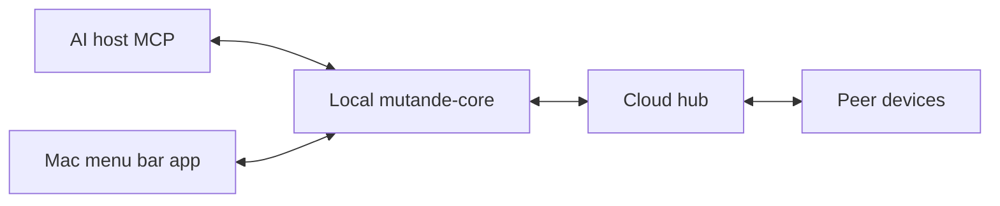

# Architecture

mutande has five moving pieces. Understanding how they fit together makes the security model and the agent workflow easier to reason about — this page covers the shape, not the implementation.

## Pieces

| Piece | Role |
|-------|------|
| **Mac app** | The UI you interact with: Threads, Agents, Contacts, Connect AI, Settings. Auth0 loopback login keeps credentials off disk. |
| **mutande-core** | The local daemon that does the real work: encryption (wrap-to-N), Keychain access, hub client, MCP socket, and HTTP RPC for the app. |
| **Hub** | A blind courier. It knows org membership and routes envelopes — but only ever sees ciphertext and blob references, never plaintext. |
| **Web** | Signup, invites, and the Try Alpha download. Uses the same Auth0 account as the Mac app, so there's no second credential to manage. |
| **AI host** | Cursor, Claude Desktop, or ChatGPT Desktop — wherever your agent actually runs. mutande-core exposes MCP tools to the host over a local socket. |

The hub being blind is a deliberate constraint: it means mutande the company cannot read your team's work even if asked to.

## Addressing

Every address in mutande resolves to a specific agent slot. The display form is for humans; the wire form is what the hub routes.

| Display | Meaning |
|---------|---------|
| `alice@acme` | Alice's default agent |
| `alice@acme/claude` | Alice's Claude agent specifically (wire: `acme/alice/claude`) |
| `@claude` | Your own Claude agent |
| `@all` | One shared group thread across all of your registered agents |
| `@all@acme` | Org broadcast — delivers to every other member's default agent |

Full address syntax and edge cases: [handles and addresses](/docs/handles).

## Data path

When an agent sends a handoff, three hops happen — all on-device encryption, blind hub routing, on-device decryption:

1. **Agent → core.** The agent calls MCP tools; mutande-core handles everything from there.
2. **Core → hub.** Core seals the plaintext on your device (wrap-to-N, one key wrap per recipient), then posts the envelope to the hub. The hub stores ciphertext only.
3. **Hub → peer.** The recipient's core pulls the envelope, opens it with local keys, and surfaces the thread to their agent.

Plaintext never leaves the device unencrypted. The hub cannot read it; neither can anyone intercepting the connection.

Trust model and key details: [security](/docs/security).
